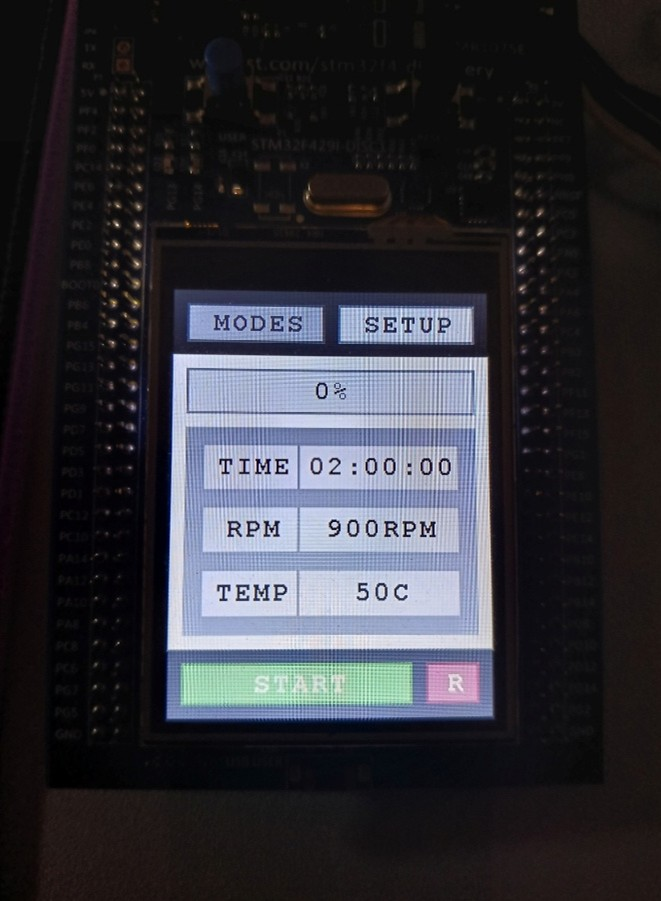
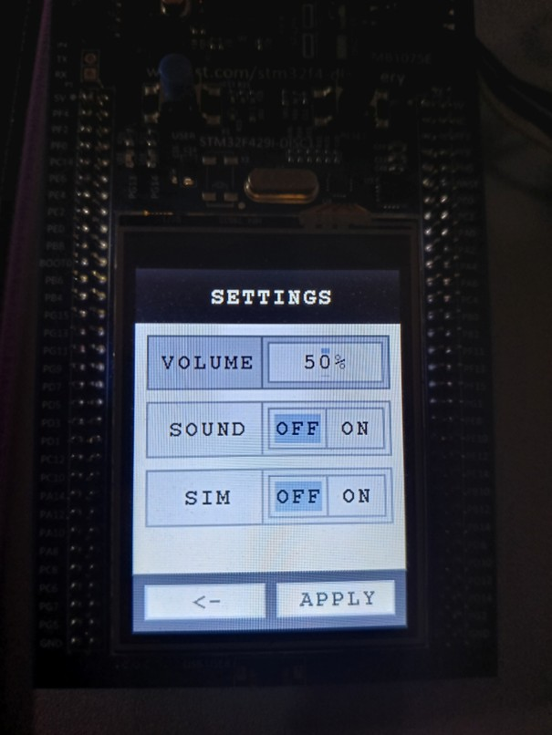
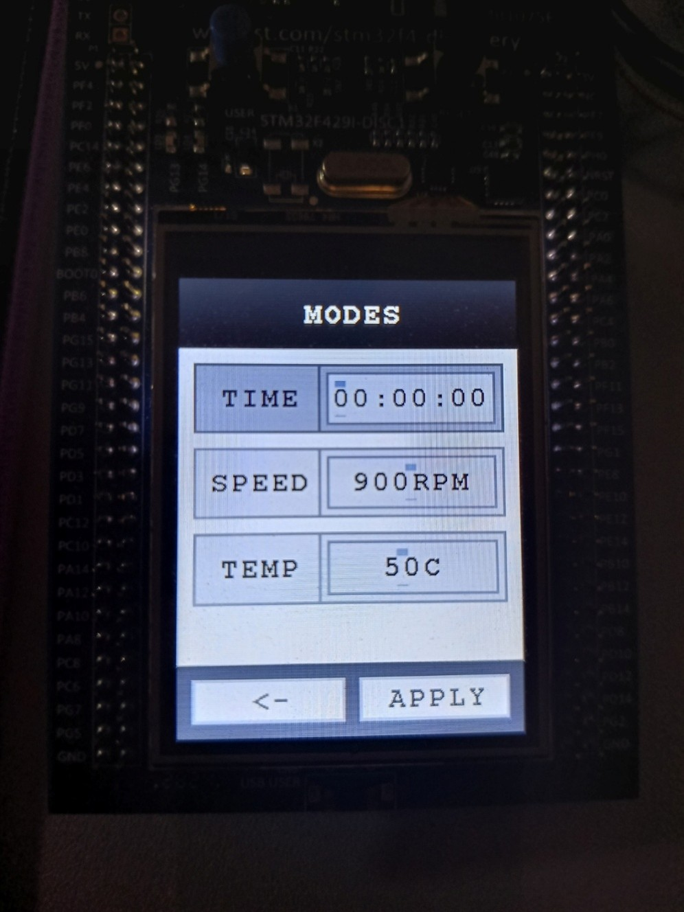
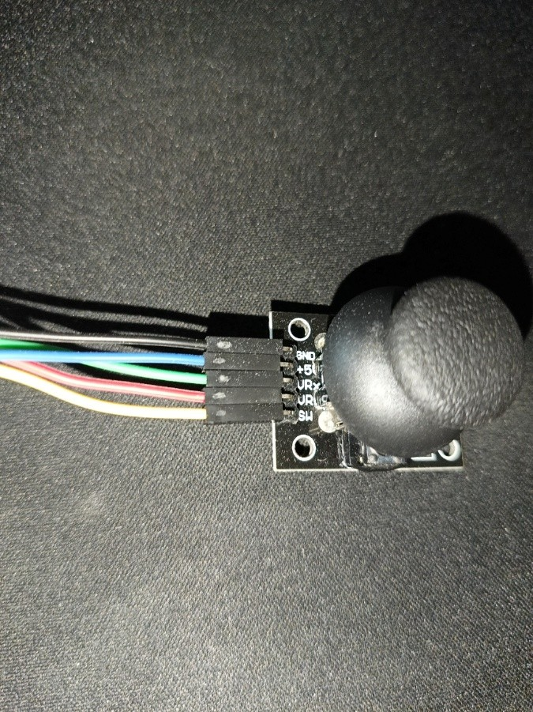
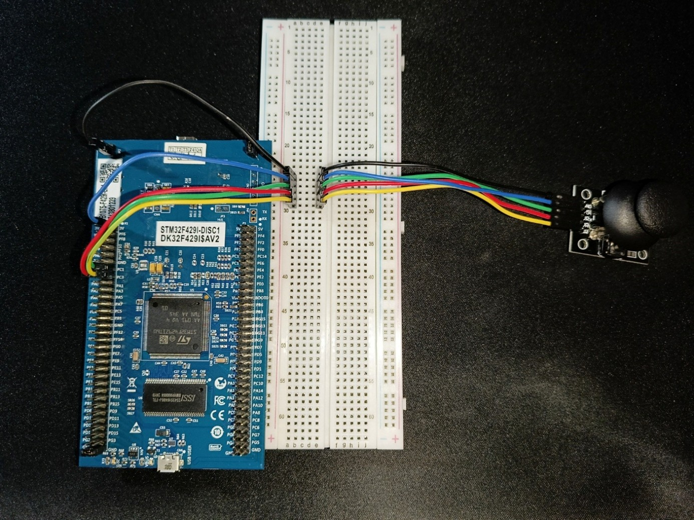

# STM32 Embedded GUI Framework

<br>

## 📖 Description
STM32 Embedded GUI Framework is a lightweight and modular GUI framework designed for embedded systems based on STM32 microcontrollers.

The project focuses on simplicity, performance, and clean architecture, making it suitable for low-level embedded development without relying on heavy external libraries.

It provides a structured way to build graphical user interfaces, handle rendering, and separate hardware-specific code from higher-level UI logic.

<br>

---

## ✨ Features
- Layered architecture: **UI / Render / Hardware**
- Clear separation between logic and hardware
- Easy to extend and customize
- Basic input support: joystick handling

<br>

---

## 🏗️ Project Structure
```
Core/
├─ Inc/
│  ├─ HW/        # Hardware abstraction layer
│  ├─ Render/    # Rendering interfaces
│  └─ UI/        # UI components and interfaces
│
└─ Src/
   ├─ HW/        # Hardware-specific code
   ├─ Render/    # Rendering implementation
   └─ UI/        # UI implementation
```

<br>

The project is divided into logical layers:
- **HW** - low-level hardware interaction
- **Render** - drawing and graphics handling
- **UI** - high-level user interface elements

<br>

---

## 🚀 Getting Started

### Requirements
- STM32CubeIDE
- STM32F429I-DISC1 board (or compatible hardware)

<br>

### Setup
1. Clone the repository:
   ```
   git clone https://github.com/krzysztof-szczepanik/stm32-embedded-gui-framework.git
   ```

3. Open STM32CubeIDE.

4. Import the project:
   - Go to **File → Open Projects from File System**
   - Select the cloned repository folder
   - Click **Finish**

5. Build the project.

6. Flash it to the board.

<br>

### Notes
- The project already contains a working example (**washing machine UI simulation**).
- It is designed as a complete framework, not a standalone library.
- Porting to other hardware may require changes in the **HW layer**.

<br>

---

## 🎬 Demo

Example of the framework running on the STM32 board (washing machine UI simulation):


<br>

---

## 🖥️ UI Screens

Example screens available in the project:

### Main Screen


### Settings Screen


### Modes Screen


<br>

---

## 🎮 Hardware Setup

This project uses a **Thumb Joystick with button v2** (Iduino ST1079) as the primary input device for navigating the UI.

#### Joystick Overview
  
The joystick module includes an analog stick for X/Y axes and a built-in button.

#### Connection Overview
  
The joystick connects to the STM32F429I-DISC1 board and a breadboard for easy prototyping. This setup allows analog reading for X/Y axes and digital read for the button press.

#### Joystick Pin Mapping

| Joystick Pin | STM32 Pin        | Notes                  |
|--------------|-----------------|-----------------------|
| GND          | GND             | Ground                |
| +5V          | +3V             | Joystick power supply |
| VRx          | PC1 (ADC1_IN11) | X-axis (analog read)  |
| VRy          | PC2 (ADC1_IN12) | Y-axis (analog read)  |
| SW           | PC3             | Button press          |

#### Notes
- Make sure to provide power to the joystick (+3V on the board, not +5V).  
- The X and Y axes use the STM32 ADC for analog input.  
- The button press is read digitally via pin PC3.  
- This setup corresponds to the **washing machine UI example** included in the project.

<br>

---

## 🤝 Contributing
This project is not actively maintained, but you are welcome to fork it for personal use or experimentation.

<br>

---

## 📄 License
This project is released under the **MIT License**. See the [LICENSE](./LICENSE) file for full details.

<br>

You are free to:
- Use, copy, and modify the code for personal or commercial projects.
- Distribute and sublicense your modifications.

<br>

You must:  
- Include the original license and copyright notice in your distributed code.

<br>

> Including a license in your project is important because it tells others exactly what they **can and cannot do** with your code, protecting both you and anyone who wants to use it.
